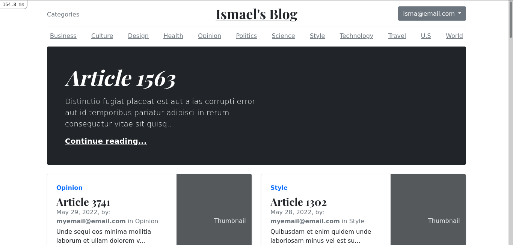
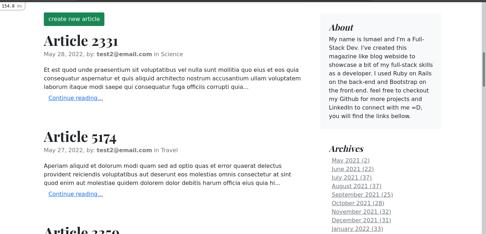

This is a blog I built using Ruby on Rails 6 in MVC pattern with a Bootstrap 5 template for the frontend, after the user is registered, the user can add a post, or comment on posts from other users. Users have different roles and privileges, Admins can add, delete and edit categories but normal users can't do any of those actions, moderators can create and edit categories but they cannot delete categories after created, only admins can delete categories.
I am still working on this project, I plan to implement the abilities to delete and edit comments, like and unlike any post, upload photos, drag and drop and many other functionalities along the way.

## Screenshot




## Built With

- [Ruby](https://www.ruby-lang.org/en/) 3.0.1
- [Rails](https://guides.rubyonrails.org/getting_started.html) 6.1.3
- [Gems](https://rubygems.org/)
  - [devise](https://github.com/heartcombo/devise)
  - [pundit](https://github.com/varvet/pundit)
  - [rolify](https://github.com/RolifyCommunity/rolify)
  - [groupdate](https://github.com/ankane/groupdate)
  - [faker](https://github.com/faker-ruby/faker)
  - [sqlite3](https://github.com/sparklemotion/sqlite3-ruby)

## Live Demo

It does not have a live version Yet!


## Initial settings to run the project

```bash
# clone the project
git clone https://github.com/ixboy/bootstrapblog.git

# enter the cloned directory
cd bootstrapblog

# install Ruby on Rails dependencies
bundle install

# install Node dependencies
yarn install

# create the development and test databases
rails db:create

# create the tables
rails db:migrate

# populate data
rails db:seed

# run the project
rails s
```

### Prerequisites

- Ruby on Rails v6.x. To learn how to install Ruby on Rails, please follow this [link](https://guides.rubyonrails.org/getting_started.html)

### Usage

- start a server with `rails s`

- open `http://localhost:3000/` in your browser.

- Sign up with your email and password, an email confirmation will be sent to you and then you can start enjoying the app...

- After seeding there will be 10 users created and the user1 and user10 are admins, the rest are all normal users, you can find the user details bellow, all users have the same password for testing purposes.
- Admins:
  - user1@email.com | password: 123456
  - user10@email.com | password: 123456
- Normal users:
  - user2@email.com | password: 123456
  - user3@email.com | password: 123456


## Deployment

- The App will be deployed in Heroku soon!!!

## Author

👤 **Iyunda Ismael Antonio**

- GitHub: [@ixboy](https://github.com/ixboy)
- Twitter: [@ismaelixboy](https://twitter.com/ismaelixboy)
- LinkedIn: [ismael-antonio](https://www.linkedin.com/in/ismaelantonio/)

## 🤝 Contributing

Contributions, issues and feature requests are welcome!

Feel free to check the [issues page](https://github.com/ixboy/bootstrapblog/issues).
